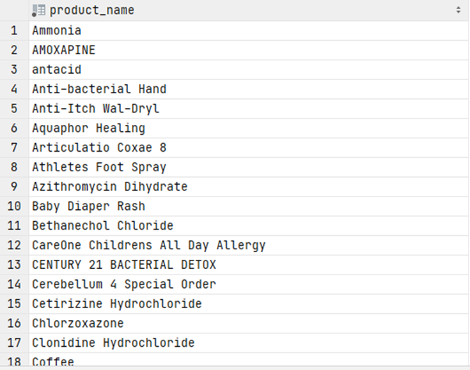

# Exercise 14

Find the name of the products, sorted alphabetically, who have reviews that contain any of the keywords: 'Great', 'Super', 'Excellent', 'Good'
but with no case-sensitivity.

<details>
<summary>Show answer</summary>



</details>

<br/>

<details>
<summary>Show SQL</summary>

```sql
SELECT DISTINCT product_name
FROM    review r,
        product p 
WHERE r.product_id = p.product_id
AND review_text ILIKE ANY (ARRAY ['%Great%', '%Super%', ''%Excellent%', '%Good%'])
ORDER BY product_name;
```

</details>